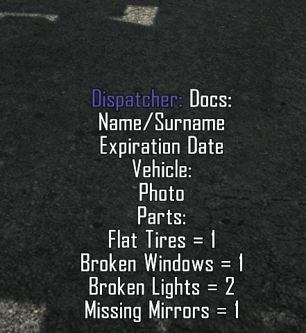
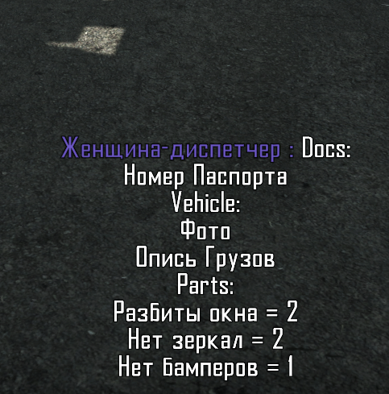

# The Contraband Police (CP) game cheat plugin
This plugin helps you to get the best report every time by showing you correct answers for every car.

## Installation
1. Install [UnityDoorstop](https://github.com/NeighTools/UnityDoorstop) to the CP
2. Change `doorstop_config.ini`:
```
target_assembly=ContrabandPolice_Data\Managed\cp_hooker.dll
```
3. Copy `cp_hooker.dll` to `ContrabandPolice_Data\Managed` folder
4. Everytime a car will enter your post, you will get the correct answers information like the following

 


## Compilation
1. Install [Harmony.Lib](https://github.com/pardeike/Harmony) to the VS project
2. Update `CSharp-Assembly` and `UnityEngine.CoreModule` paths in the project references
3. Build
